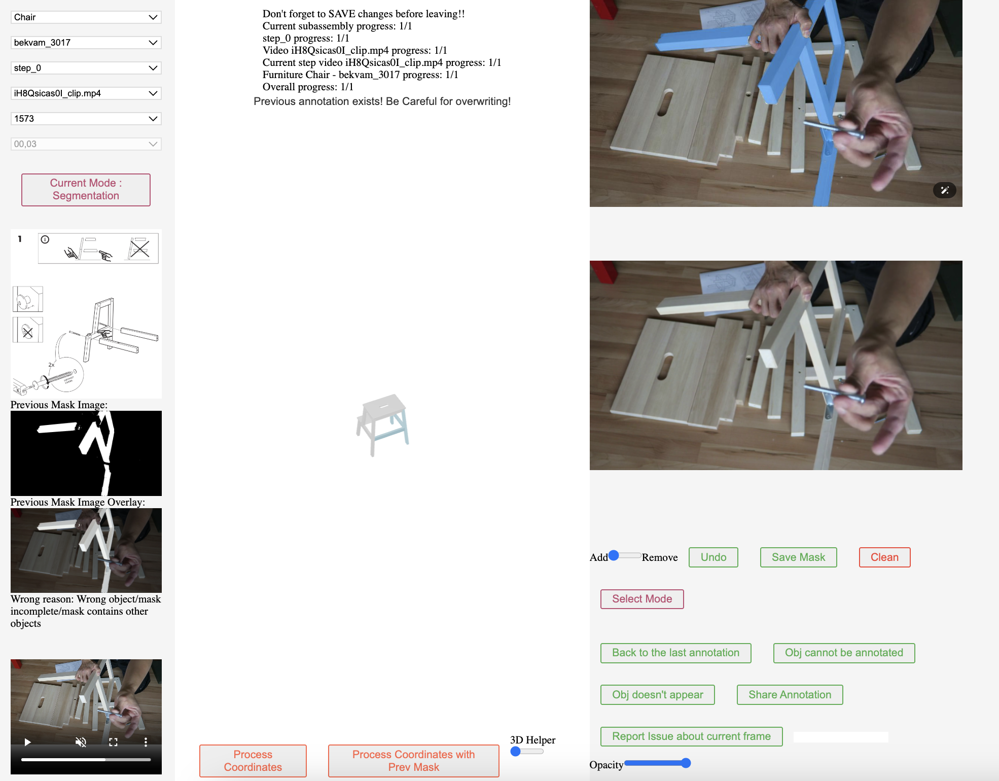
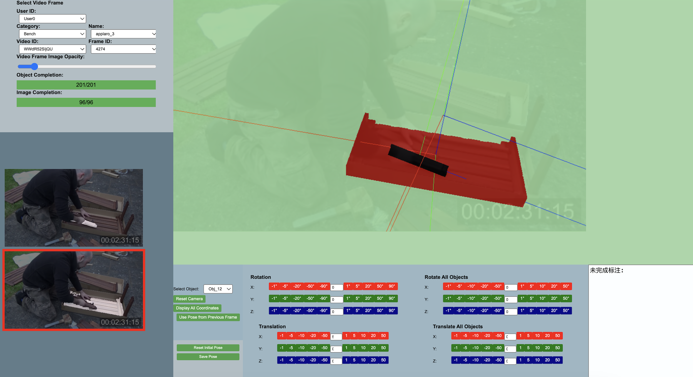

# 4D IKEA Video Annotation Interface



## Overview

We provide an annotation interface for the IKEA Manuals at Work dataset, allowing users to create detailed 4D groundings of assembly instructions on Internet videos. The interface supports both 2D mask annotation and 3D pose annotation of furniture parts in assembly videos.

## Features

- **2D Mask Annotation**: Create precise segmentation masks for furniture parts
- **3D Pose Annotation**: Establish 6-DoF poses for furniture parts in video frames
- **Progress Tracking**: Monitor annotation completion across parts, videos, and furniture items

## System Requirements

- **Backend**: Python 3.9+, Flask
- **Frontend**: Node.js (for development), modern web browser
- **GPU**: Recommended for faster processing with SAM model

## Installation

### Setup

1. Download the SAM model checkpoint:
   Download the ViT-H SAM model (`sam_vit_h_4b8939.pth`) from the [Segment Anything repository](https://github.com/facebookresearch/segment-anything#model-checkpoints) and place it in the `./SAM/weights/` directory.

2. Frontend Setup
    ```
    cd ./annotation_tool/Annotation-Interface
    npm install
    ```

3. (Optional) Update the configuration (if you want to use your own data) in `users.py` with appropriate user credentials and data paths:
    ```python
    users = {
        "username": {
            "password": "password",
            "data_json_path": "/path/to/data.json"
        }
    }
    ```

4. Update host and port settings in `.env`

## Data Preparation
put videos and parts (.obj) to ./annotation_tool/Annotation-Interface/backend/dynamic_dataset/video and ./annotation_tool/Annotation-Interface/backend/dynamic_dataset/parts
## Running the Interface

1. Start the backend and frontend server:
   ```bash
   cd ./annotation_tool/Annotation-Interface
   bash run_annotation_tool.sh
   ```

2. Open a web browser and navigate to:
   ```
   http://{your server IP}:3000
   ```

3. Log in with the credentials configured in `users.py`

## Usage Workflow

1. **Select Content**: Choose furniture category, subcategory, step, and video
2. **Select Frame**: Choose a specific frame from the video
3. **Select Part**: Choose the part(s) to annotate
4. **Create Annotation**:
   - For 2D segmentation: Add positive/negative points or use the brush tool
   - For 3D pose: Mark corresponding points on the 3D model and in the video frame
5. **Process**: Process the coordinates to generate masks or poses
6. **Save**: Save your annotations to the database
7. **Navigate**: Move to the next frame and continue the process

## Directory Structure

 ```
.
├── app.py                 # Main Flask application
├── requirements.txt       # Python dependencies
├── users.py               # User configuration
├── SAM/                   # Segment Anything Model implementation
│   └── weights/           # Place SAM model checkpoints here
├── utils/                 # Utility functions
├── pose_estimation.py     # 3D pose estimation logic
├── dynamic_dataset/       # Dataset storage
└── ... (React frontend files)
 ```


# 3D Pose Refine Interface

This tool refines 3D object poses in video frames after initial pose estimation (e.g., via PnP). It allows users to make fine-tuned adjustments to object rotations and translations, visualize results in a 3D scene, and save refined poses.


## Before Running

Replace the following placeholders in `./annotation_tool/Pose-Refine-Interface-Release/server.py` and `./annotation_tool/Pose-Refine-Interface-Release/main.js` with your actual settings:

### In `server.py`
- `OUTPUT_FOLDER = "OUTPUT_FOLDER_PLACEHOLDER"`: Output directory (e.g., `./output`).
- `OBJ_FOLDER = "OBJ_FOLDER_PLACEHOLDER"`: Path to OBJ files (e.g., `/path/to/parts`).
- `BASE_JSON_PATH = "BASE_JSON_PATH_PLACEHOLDER"`: Path to `data.json` (e.g., `./data.json`).
- `VIDEO_FOLDER = "VIDEO_FOLDER_PLACEHOLDER"`: Path to video files (e.g., `/path/to/video`).
- `BASE_PROGRESS_DATA_PATH = "BASE_PROGRESS_DATA_PATH_PLACEHOLDER"`: Path to user data (e.g., `/path/to/pose_reannotation_data/`).
- `port = "PORT_PLACEHOLDER"`: Server port (e.g., `5000`).
- `host = "HOST_PLACEHOLDER"`: Server host (e.g., `0.0.0.0`).

### In `main.js`
- `const port = "PORT_PLACEHOLDER"`: Backend port (e.g., `5000`).
- `const host = "HOST_PLACEHOLDER:${port}"`: Backend URL (e.g., `http://localhost:5000`).

## How to Run
Under folder ./annotation_tool/Pose-Refine-Interface-Release/

1. **Install Dependencies**:
   - Frontend: `npm install` (installs `three`, `vite`, etc.; `node_modules` not included).
   - Backend: `pip install flask flask-cors trimesh numpy`.

2. **Start Frontend**:
   ```bash
   cd ./annotation_tool/Pose-Refine-Interface-Release
   npx vite --port 8000
   ```
  
3. **Start Backend**:
   ```bash
   cd ./annotation_tool/Pose-Refine-Interface-Release
   python server.py
   ```

